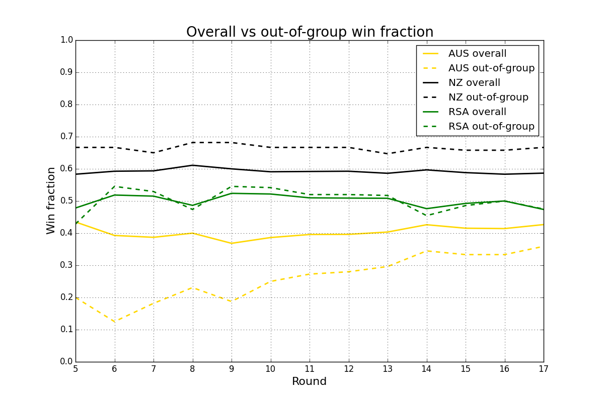

## Some statistics on the 2015 Super Rugby thus far

If you take a look at
[the 2015 Super Rugby table](http://www.smh.com.au/rugby-union/super-rugby/ladder),
it's immediately clear that NZ teams are doing extremely well.

However, the overall competition table doesn't tell you how teams from one
country are doing against the teams from the other two countries.

I was interested to see how the three countries are doing when we only
consider matches that are played between teams from different countries.
Factoring out how teams from within a country play each other might leave
you with an indication of the relative strength of the countries.

I wrote a program to examine this.

## Results

The results (below) show that NZ group teams have won 39/66 (59%) of their
games overall. But if you look at their record just in out-of-group games,
the percentage goes up: they've won 25/38 (65.8%). In contrast, Australian
group teams have won 27/65 (41.5%) of their games overall, but in
out-of-group have won only 11/33 (33.3%).

I.e., the Australian record is worse than it would appear if you just
considered their overall win/loss percentage.  Meanwhile, the NZ teams are
doing even better at beating everyone else than it might first appear from
their overall record. Meanwhile, the South African teams are doing about as
well beating others as they are overall.

This gives us some idea of the overall strength of rugby in the countries.
It doesn't give any indication about whether (e.g.) New Zealand is likely
to beat Australia in a test because the players in the Super Rugby teams
that are winning few games are much less likely to be picked for their
national sides.

The program's output (as of 2015-05-24, following Round 15) are shown
below.

The graph shows how the overall win fraction versus the out-of-group win
fraction has changed over time for each of the countries. Only rounds 5
onwards are shown as it took that long to have enough data for the general
pattern to stabilize.



### Details

Below is the detailed output of the program with results broken down by
group. Some notes:

1. The team results table is not ordered by competition points, but by
number of wins.

1. It's interesting to see that AUS teams are doing better against NZ teams (7
wins out of 18) than they are against RSA teams (4 wins out of 15).

1. RSA teams have won 11 out of 15 matches against AUS teams, but only 6
out of 20 against NZ teams.

1. It's also interesting to note that the NZ teams have played
significantly more (38) out-of-group games than RSA (35) or AUS (33). The
NZ teams are largely matched against each other in the remaining
competition rounds.


```
Results through round 15

                  Overall    vs AUS     vs NZ      vs RSA
Team         P    W  L  D    W  L  D    W  L  D    W  L  D
 HUR (NZ) : 13   12  1  0    3  1  0    5  0  0    4  0  0
 CHF (NZ) : 13    9  4  0    2  1  0    4  2  0    3  1  0
 HIG (NZ) : 13    9  4  0    3  1  0    3  2  0    3  1  0
 STO (RSA): 13    9  4  0    4  0  0    1  3  0    4  1  0
 WAR (AUS): 13    9  4  0    5  2  0    3  1  0    1  1  0
 LIO (RSA): 14    8  6  0    2  1  0    2  2  0    4  3  0
 BRU (AUS): 13    7  6  0    4  3  0    1  2  0    2  1  0
 BUL (RSA): 13    7  6  0    2  0  0    1  3  0    4  3  0
 CRU (NZ) : 13    6  7  0    1  2  0    2  4  0    3  1  0
 REB (AUS): 13    6  7  0    3  4  0    3  1  0    0  2  0
 SHA (RSA): 14    5  9  0    2  1  0    1  3  0    2  5  0
 CHT (RSA): 13    4  9  0    1  2  0    1  3  0    2  4  0
 RED (AUS): 13    3 10  0    2  4  0    0  3  0    1  3  0
 BLU (NZ) : 14    3 11  0    2  2  0    0  6  0    1  3  0
 FOR (AUS): 13    2 11  0    2  3  0    0  4  0    0  4  0

AUS teams:
  65 games played (33 vs other groups, 32 within group)
  vs NZ   W  L  D
          7 11  0
  vs RSA  W  L  D
          4 11  0
  Wins overall: 27/65 (41.54%)
  Wins out-of-group: 11/33 (33.33%)

NZ  teams:
  66 games played (38 vs other groups, 28 within group)
  vs AUS  W  L  D
         11  7  0
  vs RSA  W  L  D
         14  6  0
  Wins overall: 39/66 (59.09%)
  Wins out-of-group: 25/38 (65.79%)

RSA teams:
  67 games played (35 vs other groups, 32 within group)
  vs AUS  W  L  D
         11  4  0
  vs NZ   W  L  D
          6 14  0
  Wins overall: 33/67 (49.25%)
  Wins out-of-group: 17/35 (48.57%)
```

## Technical stuff

This repo contains a results file (`results.txt`) and a Python program to
print stats and make a plot (`process.py`).

Neither the program nor its input have been fully checked for accuracy yet!
I'm fairly certain they're correct.

Usage is as follows:

```sh
$ ./process.py --help
usage: process.py [-h] [--rounds ROUNDS] [--printResults] [--plot]

Print statistics about the 2015 Super Rugby competition

optional arguments:
  -h, --help       show this help message and exit
  --rounds ROUNDS  Only consider games up to (and including) the given round.
  --printResults   If True, print individual match results.
  --plot           If True, plot round-by-round overall and out-of-group win
                   fractions
```

The `results.txt` file must have 5 fields per line: `round`, `team1`,
`points1`, `team2`, and `points2`. The round numbers *must* be
non-decreasing so that the end-of-round statistics gathering will work
correctly.
